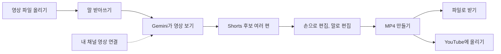

# Agentic Shorts 생성 스튜디오

강의, 인터뷰, 토크처럼 말로 정보를 전하는 긴 영상을 올리면 Gemini가 영상을 직접 보고 세로 Shorts를 여러 편 골라 줘요. 고른 결과는 브라우저에서 다듬은 뒤 MP4 파일로 받거나 내 YouTube 채널에 바로 올리면 돼요.

Shorts에 나오는 목소리와 화면은 모두 올린 원본에서 잘라 온 거예요. AI 목소리를 입히거나 원본에 없는 장면을 만들지 않아요. 앱 화면은 한국어예요.

> [!TIP]
> 실제 화면을 보면서 따라 하고 싶다면 [실습 가이드](docs/index.html)를 내려받아 브라우저로 여세요. 스크린숏과 함께 15단계를 안내하고, 단계마다 체크리스트가 있어요.

이 문서는 두 부분이에요. [개발자 안내](#개발자-안내) 앞까지는 앱을 쓰는 사람을 위한 설명이고, 그 뒤는 서버를 직접 띄우거나 코드를 고치는 사람을 위한 내용이에요.

- [이런 일을 해요](#이런-일을-해요)
- [어떻게 동작하나요](#어떻게-동작하나요)
- [사용 순서](#사용-순서)
- [알아 두면 좋은 점](#알아-두면-좋은-점)
- [자주 묻는 질문](#자주-묻는-질문)
- [용어](#용어)
- [개발자 안내](#개발자-안내)

## 이런 일을 해요

- 영상 하나로 Shorts 후보를 여러 편 만들어요. 기본 프롬프트는 Shorts 3편을 만들라고 Gemini에게 부탁해요. 한 편은 30초에서 60초 길이이고, 원본의 구간 2개에서 5개를 이어 붙여요.
- 후보마다 Gemini가 제목과 헤드라인을 써 줘요. 헤드라인은 Shorts가 끝날 때까지 화면 위쪽에 떠 있는 큰 글씨예요.
- 말과 말 사이의 조용한 틈은 자동으로 빼요. 그래서 말이 끊기지 않고 이어져요.
- 받아쓰기가 단어마다 말한 시각을 남겨서 자막이 목소리에 맞춰 나와요. 틀린 글자는 직접 고치면 돼요.
- 내 채널에 이미 올린 같은 영상을 연결하면 YouTube 통계도 같이 써요. 시청자가 많이 본 구간은 넣고 적게 본 구간은 빼라고 Gemini에게 알려 주고, 실제 댓글도 참고하게 해요.
- 구간, 순서, 자막 글자, 색, 글꼴, 이미지, 배경음악을 손으로 고칠 수 있어요.
- "헤드라인을 노란색으로 크게"처럼 말하거나 적으면 그대로 고쳐 주는 말로 편집이 있어요.
- 완성한 Shorts는 1080p, 1440p, 4K 중 하나로 MP4를 만들어요. 파일로 받거나 내 채널에 바로 올려요.
- 분석 한 번에 Gemini 비용이 대략 얼마 들었는지 화면 위에 보여 줘요.

## 어떻게 동작하나요



점선은 하지 않아도 되는 단계예요.

1. 분석을 시작하면 영상 속 말을 단어마다 시각까지 받아써요. Google Cloud Speech-to-Text로 먼저 받아쓰고, 안 되면 연결한 YouTube 영상의 공식 자막을 써요. 둘 다 없으면 Gemini가 영상을 보면서 받아써요. YouTube가 자동으로 만든 자막은 시각이 어긋나서 쓰지 않아요.
2. Gemini는 360p로 줄인 사본을 보고 들으면서 어느 구간을 어떤 순서로 이을지 정해요. 구간의 시작과 끝도 Gemini가 정해요.
3. 편집은 모두 브라우저 안에서 바로 반영돼요. 미리보기는 MP4와 같은 구간 계산, 같은 글꼴 파일로 그려요.
4. MP4는 서버가 ffmpeg로 만들어요. 이때는 줄인 사본이 아니라 처음 올린 원본을 써요.

## 사용 순서

### 1. 로그인

"Google / YouTube 계정으로 로그인"을 누르고 Shorts를 올릴 채널의 Google 계정을 고르세요. Google이 권한 몇 가지를 물어요. 각 권한을 어디에 쓰는지는 [로그인할 때 묻는 권한](#로그인할-때-묻는-권한)에 적어 두었어요.

### 2. 영상 올리기

시작 화면에 영상 파일을 끌어다 놓거나 "파일 선택"을 누르세요. 파일을 고르면 바로 올라가기 시작해요. mp4, mov, m4v, mkv, webm 파일을 올릴 수 있어요.

같은 영상이 내 채널에 이미 있다면 "내 채널 영상 연결"에서 이어 주세요. 연결하지 않아도 Shorts는 만들어져요.

- 올린 파일과 길이 차이가 2초 이내인 영상이 있으면 그중 가장 최근에 올린 영상을 자동으로 골라요.
- 목록에서 직접 고르거나 "YouTube 영상 URL 또는 영상 ID 직접 입력" 칸에 주소를 넣어도 돼요. 제목, 설명, 태그에 `#shorts`나 `#쇼츠`가 있는 영상은 목록에 나오지 않아요.
- 연결하면 시청자 유지율 곡선, 조회수, 좋아요 수, 댓글 수, 공식 자막이 있는지가 보여요. 잘못 골랐다면 "연결 해제"를 누르세요.
- 파일과 연결한 영상의 길이가 다르면 경고가 떠요.
- "데이터로 프롬프트 튜닝"을 누르면 많이 본 구간, 적게 본 구간, 시청자 댓글을 Shorts 생성 프롬프트에 글로 넣어 줘요.

Shorts 생성 프롬프트는 어떤 구간을 골라 어떻게 엮을지 Gemini에게 알려 주는 지시문이에요. "Shorts 생성 프롬프트 바꾸기"를 펼치면 기본 문장을 보고 고칠 수 있고, "기본값으로"를 누르면 처음 문장으로 돌아가요.

올리기가 끝나면 "Shorts 만들기"를 누르세요.

### 3. 분석 기다리기

분석하는 동안 "Gemini가 영상을 보고 있어요" 같은 안내 한 줄과 지난 시간이 보여요. 영상 길이에 따라 몇 분 걸릴 수 있어요. 멈추려면 "중단"을 누르세요. 분석이 실패하면 오류 문장과 함께 시작 화면으로 돌아가는데, 올린 파일은 그대로 있어서 "Shorts 만들기"만 다시 누르면 돼요.

### 4. 편집하기

넓은 화면에서 편집 화면은 이렇게 나뉘어요.

| 자리 | 있는 것 |
| --- | --- |
| 맨 위 머리글 | 분석 비용과 걸린 시간, 실행 취소, 다시 실행, 다시 분석, 새 영상, 내보내기, 내 채널 프로필과 로그아웃, 테마 메뉴 |
| 그 아래 "시나리오" 줄 | Gemini가 만든 Shorts 후보들. 하나를 누르면 그 Shorts를 편집해요 |
| 왼쪽 | 고른 Shorts의 클립 목록 |
| 가운데 | 9:16 미리보기. 오른쪽 설정을 스크롤해도 제자리에 있고, 전체 화면으로도 볼 수 있어요 |
| 오른쪽 | 자막, 스타일, 소리, 반응·댓글 탭 |
| 오른쪽 아래 | 말로 편집 창 |

#### 클립 다듬기

클립은 원본에서 잘라 온 한 구간이에요. 왼쪽에서 클립을 고르면 이런 걸 할 수 있어요.

- 구간 막대의 양 끝을 끌어 시작과 끝을 바꿔요. 막대 가운데를 끌면 길이는 그대로 두고 옮겨요.
- 1초, 5초 단위 버튼으로 클립을 통째로 앞뒤로 밀어요. "이전 대사 포함"과 "다음 대사 포함"은 바로 앞이나 뒤 문장까지 넓혀요.
- "주변 구간"과 "전체 영상"으로 막대가 보여 주는 시간 범위를 바꿔요.
- 순서를 위아래로 바꾸고, 가운데 단어에서 둘로 나누고, 지울 수 있어요.
- "원본 클립"으로 원본의 다른 구간을 더해요. "이미지 삽입"과 "영상 삽입"으로는 내 사진이나 다른 영상을 클립 사이에 끼워 넣어요. 넣은 이미지는 보여 줄 시간을, 넣은 영상은 쓸 구간과 소리 끄기를 정해요.
- 내 채널 영상을 연결했다면 막대 위에 시청자 유지율 곡선이 겹치고, 클립에 "많이 본 구간"이나 "적게 본 구간" 표시가 붙어요.
- "Gemini 제안으로 되돌리기"를 누르면 이 Shorts를 Gemini가 처음 제안한 모습으로 되돌려요.

#### 자막 고치기

자막 탭에는 전체 대본이 줄마다 나와 있어요.

- "현재 클립만"을 고르면 고른 클립의 대사만 보여요. "대사 검색"으로 찾을 수도 있어요.
- 미리보기를 재생하면 지금 말하는 단어와 줄을 따라 표시가 움직여요. 줄의 시각을 누르면 미리보기가 그 자리로 가요.
- 단어를 누르면 글자를 고치거나, 단어를 지우거나, 거기서 클립을 시작하거나 끝내거나 나눌 수 있어요. 지운 단어는 소리와 화면에서도 빠지고, "복구"로 되살려요.
- 줄 옆의 "시작"과 "끝"은 그 줄에서 클립을 시작하거나 끝내요. "+클립"은 그 줄을 새 클립으로 넣고, "줄 수정"은 한 줄 글자를 한 번에 고쳐요.
- "자막 설정"을 펼치면 자막 높이, 글자 크기, 한 줄 최대 글자 수, 글자 색, 배경 박스를 바꿔요.

#### 모양 바꾸기

스타일 탭에서 클립이 화면에 보이는 모양을 정해요.

- 적용 범위가 "모든 클립"이면 모든 클립이 같은 모양을 써요. 클립 하나만 다르게 꾸미려면 그 클립을 고르고 "이 클립만"을 누르세요.
- 헤드라인 줄을 쓰고, 더하고, 지워요. 첫 줄은 강조색, 나머지 줄은 기본색으로 나와요.
- 영상 배치는 "박스"와 "전체 화면" 중에서 골라요. 박스는 16:9 기본, 4:3, 1:1 정사각, 4:5 세로 비율이 있고 크기와 위치도 바꿀 수 있어요.
- 배경색, 영상 테두리, 헤드라인과 자막의 글꼴, 색, 외곽선, 배경 박스를 바꿔요. 글꼴은 무료 한글 글꼴 10종 중에서 골라요.
- "이미지 추가"로 사진을 얹고 크기, 회전, 위치를 바꿔요.
- 미리보기에서 글자, 이미지, 영상 박스를 끌어 옮길 수 있어요. 헤드라인, 자막, 이미지를 누르면 오른쪽 탭이 그 항목의 설정으로 바로 옮겨 가요.

#### 배경음악 넣기

소리 탭에서 "음악 추가"로 음악 파일을 고르고 "음악 볼륨"을 맞춰요. 음악은 Shorts 길이만큼 반복되다가 끝에서 1.5초 동안 작아지며 끝나요. 원본 목소리 크기는 바뀌지 않아요.

#### 시청자 반응 보기

내 채널 영상을 연결했다면 반응·댓글 탭에서 많이 본 구간, 적게 본 구간, 시청자 댓글을 볼 수 있어요.

#### 말로 편집

오른쪽 아래 창에 원하는 걸 적거나, "말로 입력" 마이크 버튼을 누르고 말하세요. 이런 식으로 요청하면 돼요.

- "헤드라인을 노란색으로 크게"
- "2번 클립을 3초 줄여 줘"
- "첫 클립이랑 마지막 클립 순서 바꿔 줘"
- "배경음악 볼륨 30%로"

Gemini가 요청을 편집 동작으로 바꾸면 브라우저가 한꺼번에 적용해요. 답과 참고 사항은 창에 글로 보이고, 마음에 안 들면 "되돌리기"를 누르면 돼요. "지난 대화"를 열면 이번 편집 중에 한 요청을 다시 볼 수 있어요. 창은 접어서 작은 버튼으로 둘 수 있어요.

말로 편집으로는 이런 걸 할 수 있어요.

- 클립의 구간, 길이, 순서를 바꾸고 나누거나 지우기
- 원본 구간이나 미리 올려 둔 이미지와 영상을 클립으로 넣기
- 스타일과 얹은 이미지 바꾸기
- 자막 글자 고치기, 단어 지우기
- 배경음악과 볼륨 바꾸기
- Gemini가 처음 제안한 모습으로 되돌리기

다시 분석, MP4 만들기, 업로드, 새 파일 올리기는 하지 않아요. 이미지나 음악은 먼저 손으로 올려 두어야 말로 편집에서 쓸 수 있어요.

요청할 때 영상은 다시 보내지 않아요. 지금 보고 있는 Shorts 상태와 대본 글만 Gemini에 보내요.

#### 실행 취소

머리글의 실행 취소와 다시 실행은 손으로 한 편집과 말로 편집을 함께 100단계까지 기억해요. 단축키는 Ctrl+Z와 Ctrl+Shift+Z이고, Mac에서는 ⌘+Z와 ⌘+Shift+Z예요. 글자를 입력하는 칸 안에서는 그 칸의 실행 취소로 동작해요.

#### 다시 분석

결과가 마음에 들지 않으면 머리글의 "다시 분석"을 누르세요. Shorts 생성 프롬프트를 고치고 "분석 방식"을 고른 뒤 시작해요.

- "빠른 분석 (자막)"은 저장해 둔 대본 글만 보고 구간을 다시 골라요. 영상을 다시 보내지 않아서 빠르고 싸요. 처음에는 이게 골라져 있어요.
- "정밀 분석 (화면)"은 영상을 다시 봐요. 슬라이드나 판서처럼 화면을 봐야 고를 수 있는 요청에 쓰세요. 첫 분석 뒤 1시간 안에는 Gemini에 올려 둔 영상을 다시 써서 비용이 덜 들어요.

새 결과가 오면 지금 편집 내용은 사라져요. 다시 분석하는 동안 머리글에 진행 막대가 보이고, 실패하면 편집 내용이 그대로 남아요.

### 5. 내보내기

머리글의 "내보내기"를 누르세요.

1. "화질 선택"에서 1080p, 1440p, 4K 중 하나를 고르세요. 처음에는 1440p가 골라져 있어요. 1080p보다 가운데 영상 박스가 커서 원본이 더 선명하게 남아요.
2. "MP4 만들기"를 누르면 서버가 MP4를 만들어요. 다 되면 창 안에서 재생해 보고 "MP4 파일 다운로드"로 받아요. 파일 이름은 "원본파일이름-Shorts제목.mp4" 꼴이에요.
3. 내 채널에 바로 올리려면 제목, 설명, 공개 상태를 정하고 "YouTube Shorts로 업로드"를 누르세요. 공개 상태는 비공개, 일부 공개, 공개 중에서 골라요. 설명 칸에는 `#Shorts`가 미리 들어 있어요.

## 알아 두면 좋은 점

- 편집 중인 내용은 브라우저에만 있어요. 새로고침하거나 탭을 닫으면 사라지니, 마음에 드는 Shorts는 바로 내보내기로 받아 두세요.
- 올린 영상과 만든 MP4는 서버에 오래 남지 않아요. 서버 디스크에서는 24시간, Cloud Storage 버킷에서는 하루가 지나면 지워져요.
- 편집 화면 위의 "약 \$0.21 · 3분 12초" 같은 표시는 분석 한 번에 쓴 Gemini 토큰을 공개 정가로 계산한 추정 비용과 걸린 시간이에요. 실패해서 다시 시도한 호출도 더해요. 실제 청구액과는 다를 수 있고, 말로 편집 비용은 들어가지 않아요.
- 분석하려고 영상의 줄인 사본은 Gemini에, 소리는 Google Cloud Speech-to-Text에 보내요. MP4는 처음 올린 원본으로 만들어요.
- Gemini 호출이 실패하면 정해 둔 다른 모델로 차례로 다시 시도해요. 그래도 안 되면 가짜 결과를 만들지 않고 오류를 보여 줘요.
- 아주 긴 영상은 분석하지 못할 수 있어요. Gemini에 보내는 줄인 사본이 100MB를 넘으면 분석을 멈추고 오류를 보여 줘요.
- 말로 편집의 마이크까지 쓰려면 Chrome으로 여세요.
- 테마는 처음에 기기 설정을 따라요. 머리글의 테마 메뉴에서 시스템, 라이트, 다크를 고르면 브라우저가 기억해요.

### 올릴 수 있는 파일

| 쓰는 곳 | 형식 |
| --- | --- |
| 원본 영상, 삽입 영상 | mp4, mov, m4v, mkv, webm |
| 이미지 | png, jpg, jpeg, webp, gif, bmp |
| 배경음악 | mp3, m4a, aac, wav, ogg, opus, flac |

### 로그인할 때 묻는 권한

| 권한 | 범위 | 앱이 쓰는 곳 |
| --- | --- | --- |
| 기본 프로필과 이메일 | `openid`, `email`, `profile` | 머리글에 내 계정 표시 |
| YouTube 계정 보기 | `youtube.readonly` | 내 채널 정보와 영상 목록 |
| YouTube 계정 관리 | `youtube.force-ssl` | 공식 자막 내려받기. YouTube가 자막을 내려받을 때 이 권한을 요구해요. 앱 코드는 이 권한으로 읽기만 해요 |
| YouTube Analytics 보기 | `yt-analytics.readonly` | 시청자 유지율 곡선 |
| YouTube 동영상 업로드 | `youtube.upload` | 완성한 Shorts 올리기 |

## 자주 묻는 질문

### "Shorts 만들기" 버튼이 눌리지 않아요

시작 화면 위에 빨간 안내가 있다면 서버가 Gemini를 부를 준비가 안 된 거예요. 안내 문장에 고칠 방법이 적혀 있어요. 서버를 직접 띄웠다면 [Gemini 연결](#gemini-연결)을 보세요. Vertex AI를 쓰는데 Google Cloud 로그인이 만료됐다면 터미널에서 `gcloud auth application-default login`을 실행하고 페이지를 새로고침하면 돼요.

Shorts 생성 프롬프트를 모두 지워도 버튼이 잠겨요. 이때는 "기본값으로"를 누르세요.

### 로그인 버튼 대신 "OAuth 클라이언트 설정 필요"가 보여요

서버에 OAuth 클라이언트 값이 없는 상태예요. [OAuth 클라이언트 만들기](#oauth-클라이언트-만들기)를 따라 `.env`에 값을 넣고 서버를 다시 켜세요.

### 로그인하면 Google 오류 화면이 떠요

`redirect_uri_mismatch` 오류라면 OAuth 클라이언트의 승인된 리디렉션 URI에 지금 앱 주소 뒤에 `/api/shortform/auth/callback`을 붙인 주소가 없는 거예요. OAuth 동의 화면이 테스트 상태라면 테스트 사용자로 등록한 계정만 들어올 수 있어요.

### 마이크 버튼이 없어요

브라우저가 음성 인식을 지원하지 않으면 마이크 버튼을 숨겨요. Firefox가 그래요. Chrome에서 열면 보여요. 글로 적어서 보내는 건 어느 브라우저에서나 돼요.

### 연결한 영상과 길이가 다르다는 경고가 떠요

올린 파일과 YouTube 영상이 서로 다른 영상이거나 한쪽이 편집본일 수 있어요. 길이가 다르면 많이 본 구간과 적게 본 구간의 시각이 파일과 어긋날 수 있어요. 같은 영상을 고르거나 "연결 해제"를 누르세요.

### 다시 분석했더니 편집한 내용이 사라졌어요

다시 분석은 Shorts를 새로 받아 와서 지금 편집을 통째로 바꿔요. 실행 취소로도 돌아갈 수 없으니, 남기고 싶은 Shorts는 다시 분석하기 전에 내보내기로 받아 두세요.

## 용어

| 화면에서 보는 말 | 뜻 |
| --- | --- |
| Shorts, 시나리오 | Gemini가 제안한 Shorts 한 편. "시나리오" 줄에서 골라 편집해요 |
| 클립 | Shorts를 이루는 한 구간. 원본에서 잘라 온 구간이거나 끼워 넣은 이미지나 영상이에요 |
| 헤드라인 | Shorts 내내 떠 있는 큰 제목 글씨 |
| 스타일 | 클립이 보이는 모양. 헤드라인, 영상 배치, 색과 글꼴, 글자 위치, 얹은 이미지를 묶어 불러요 |
| Shorts 생성 프롬프트 | 분석할 때 Gemini에게 주는 지시문 |
| 시청자 유지율 | 영상의 각 지점을 시청자가 얼마나 봤는지 보여 주는 YouTube Analytics 통계 |
| 말로 편집 | 말이나 글로 요청하면 편집을 대신해 주는 기능 |
| MP4 만들기 | 편집한 Shorts 한 편을 MP4 파일로 만드는 일 |

코드와 설계 문서에서 쓰는 영어 이름은 [CONTEXT.md](CONTEXT.md)에 정리돼 있어요.

---

## 개발자 안내

백엔드는 Python FastAPI, 프런트엔드는 React 19와 Vite예요. 컨테이너 하나로 묶어 Cloud Run에 올려요.

### 준비물

- Python 3.14 이상과 [uv](https://docs.astral.sh/uv/)
- Node.js 22
- ffmpeg, ffprobe
- Google OAuth 2.0 웹 클라이언트 ID와 Secret
- Gemini를 부를 방법 하나. Gemini API 키 또는 Vertex AI를 쓸 수 있는 Google Cloud 프로젝트

### 로컬에서 실행하기

```bash
cp .env.example .env   # OAuth 클라이언트와 Gemini 연결 방식 채우기
uv sync
npm --prefix frontend install
npm --prefix frontend run dev
```

브라우저에서 http://localhost:3000 을 여세요. `npm run dev`는 Vite 개발 서버를 3000번 포트에 띄우고, 5000번 포트에서 백엔드가 응답하지 않으면 `uv run python -m src.main`으로 백엔드도 같이 띄워요. 백엔드는 코드가 바뀌어도 저절로 다시 시작하지 않아요. Python 코드나 `.env`를 고쳤다면 dev 서버를 껐다 켜세요.

- 백엔드만 띄우려면 `uv run python -m src.main`을 쓰세요. `frontend/dist`가 있으면 백엔드가 화면도 같이 보여 줘요. `npm --prefix frontend run build`로 만들 수 있어요.
- API 문서는 백엔드의 `/docs`에 있어요. 로컬이면 http://localhost:5000/docs 예요.
- 타입 검사는 `npm --prefix frontend run lint`예요.

### 환경 변수

`.env.example`을 복사해 쓰세요. 기본값은 `src/core/config.py`가 정해요.

| 변수 | 기본값 | 뜻 |
| --- | --- | --- |
| `GEMINI_API_KEY` | 없음 | Gemini API 키. Vertex AI를 쓰면 비워 둬요 |
| `GOOGLE_GENAI_USE_VERTEXAI` | 꺼짐 | `true`면 Vertex AI로 Gemini를 불러요 |
| `GOOGLE_CLOUD_PROJECT` | 없음 | Vertex AI와 Speech-to-Text를 쓸 프로젝트 |
| `GOOGLE_CLOUD_LOCATION` | `global` | Vertex AI 위치. 리전을 고르면 Gemini 요금이 10% 비싸요 |
| `GEMINI_SHORTFORM_MODEL` | `gemini-3.8-flash` | 처음 시도할 모델. `GEMINI_MODEL`도 읽어요 |
| `GEMINI_FALLBACK_MODELS` | `gemini-3.8-flash,gemini-3.7-flash,gemini-3.6-flash,gemini-3.5-flash-lite` | 실패하면 차례로 시도할 모델 |
| `GEMINI_TIMEOUT_SEC` | `600` | 호출 하나의 제한 시간 |
| `GEMINI_ATTEMPTS_PER_MODEL` | `2` | 모델마다 시도할 횟수 |
| `GEMINI_RETRY_DELAY_SEC` | `3` | 다시 시도하기 전에 기다리는 초 |
| `GOOGLE_OAUTH_CLIENT_ID`, `GOOGLE_OAUTH_CLIENT_SECRET` | 없음 | 로그인에 쓰는 OAuth 웹 클라이언트 |
| `BACKEND_PORT` | `5000` | 백엔드 포트. `PORT`도 읽어요 |
| `STUDIO_WORKDIR` | 임시 폴더 아래 `ytcreator-studio` | 업로드, 자막, 렌더 결과를 두는 로컬 폴더 |
| `STUDIO_RETENTION_HOURS` | `24` | 로컬 파일을 지우기 전까지 두는 시간 |
| `STUDIO_GCS_BUCKET` | 없음 | 값이 있으면 파일을 이 Cloud Storage 버킷에도 둬요. 비우면 로컬 디스크만 써요 |
| `STUDIO_HEARTBEAT_SEC` | `5` | 분석 스트림이 연결을 붙잡아 두려고 보내는 신호의 간격 |
| `STUDIO_SUBPROCESS_TIMEOUT_SEC` | `900` | ffmpeg 같은 외부 명령의 제한 시간 |
| `STUDIO_SILENCE_NOISE_DB`, `STUDIO_SILENCE_MIN_SEC` | `-35`, `0.1` | 이보다 조용하고 이보다 긴 구간을 무음으로 봐요 |
| `STUDIO_ANALYSIS_PROXY_HEIGHT`, `STUDIO_ANALYSIS_PROXY_FPS` | `360`, `10` | Gemini에 보내는 분석용 사본의 높이와 초당 프레임 |
| `STUDIO_MAX_INLINE_VIDEO_MB` | `100` | 사본을 요청에 직접 담을 수 있는 최대 크기. 사본이 이보다 크면 분석이 오류로 멈춰요 |
| `STUDIO_CONTEXT_CACHE_TTL_SEC` | `3600` | 사본을 Gemini Context Cache에 두는 시간 |
| `STUDIO_SPEECH_PROJECT` | `GOOGLE_CLOUD_PROJECT` 값 | Speech-to-Text를 부를 프로젝트 |
| `STUDIO_SPEECH_LOCATION`, `STUDIO_SPEECH_MODEL`, `STUDIO_SPEECH_LANGUAGES` | `us`, `chirp_3`, `auto` | Speech-to-Text 위치, 모델, 언어 |
| `FFMPEG_BIN`, `FFPROBE_BIN` | PATH에 있는 `ffmpeg`, `ffprobe` | ffmpeg 실행 파일 |

### OAuth 클라이언트 만들기

1. Google Cloud Console의 APIs & Services > Credentials에서 OAuth 2.0 Client ID를 Web application 종류로 만드세요.
2. Authorized redirect URIs에 앱 주소 뒤에 `/api/shortform/auth/callback`을 붙인 주소를 넣으세요.
   - 로컬은 `http://localhost:3000/api/shortform/auth/callback`
   - Cloud Run은 `https://<서비스 URL>/api/shortform/auth/callback`
3. 받은 값을 `.env`에 넣고 서버를 다시 켜세요.

```bash
GOOGLE_OAUTH_CLIENT_ID=...
GOOGLE_OAUTH_CLIENT_SECRET=...
```

OAuth 클라이언트가 속한 프로젝트에서 YouTube Data API v3와 YouTube Analytics API를 켜 두세요. `deploy.sh`는 배포 프로젝트에서 두 API를 자동으로 켜요. OAuth 동의 화면이 테스트 상태면 테스트 사용자로 등록한 계정만 로그인할 수 있어요. 요청하는 범위는 `src/youtube/oauth.py`의 `OAUTH_SCOPES`에 있고, 각 범위를 쓰는 곳은 [로그인할 때 묻는 권한](#로그인할-때-묻는-권한)에 정리했어요.

### Gemini 연결

`.env`에서 둘 중 하나를 골라요. 설정이 빠졌거나 Vertex AI 로그인이 만료되면 시작 화면에 고칠 방법을 보여 주고 "Shorts 만들기"를 잠가요.

| 방식 | 설정 | 인증 |
| --- | --- | --- |
| Gemini API | `GEMINI_API_KEY` | Google AI Studio에서 받은 API 키 |
| Vertex AI | `GOOGLE_GENAI_USE_VERTEXAI=true`, `GOOGLE_CLOUD_PROJECT`, `GOOGLE_CLOUD_LOCATION` | ADC. 로컬은 `gcloud auth application-default login`, Cloud Run은 런타임 서비스 계정 |

로컬에서 Vertex AI API나 Speech-to-Text API가 꺼져 있으면 서버가 `src/infra/gcp.py`로 켜 보고, 못 켜면 켜는 콘솔 주소를 오류에 넣어 줘요.

### 받아쓰기와 파일 보관

- 받아쓰기는 Cloud Speech-to-Text V2의 `chirp_3` 모델을 먼저 써요. `STUDIO_SPEECH_PROJECT`나 `GOOGLE_CLOUD_PROJECT`에 프로젝트가 있고 ADC로 부를 수 있어야 해요. 부르지 못하면 경고를 남기고 연결한 YouTube 영상의 공식 자막으로, 그것도 없으면 Gemini 받아쓰기로 넘어가요. 그래서 Gemini API 키만 있어도 앱은 돌아가요.
- `STUDIO_GCS_BUCKET`이 비어 있으면 모든 파일을 `STUDIO_WORKDIR`에 두고 24시간 뒤 지워요. 버킷을 정하면 원본, 분석용 사본, 자막, YouTube 데이터, 캐시 정보, 로그인 세션, 이미지와 음악, 렌더 결과를 버킷에도 두고, 브라우저는 원본을 버킷에 바로 올려요. Cloud Run처럼 인스턴스가 여러 개 뜨는 곳에서는 버킷이 있어야 해요.

### Cloud Run에 배포하기

`deploy.sh`가 Cloud Build로 이미지를 만들고 Terraform으로 Cloud Run 서비스를 만들어요. `gcloud`에 로그인돼 있어야 하고 Terraform 1.5 이상이 필요해요.

```bash
./deploy.sh
```

OAuth 값은 `.env`의 `GOOGLE_OAUTH_CLIENT_ID`, `GOOGLE_OAUTH_CLIENT_SECRET`을 읽어 Terraform에 넘겨요. 환경 변수로 줘도 돼요.

```bash
GOOGLE_OAUTH_CLIENT_ID="your-client-id.apps.googleusercontent.com" \
GOOGLE_OAUTH_CLIENT_SECRET="your-client-secret" \
./deploy.sh
```

스크립트는 이 순서로 움직여요.

1. `.env`에서 프로젝트와 OAuth 값을 읽어요. 프로젝트 기본값은 `.env`의 `GOOGLE_CLOUD_PROJECT`, 없으면 `ytcreator-508301`이에요. 리전은 `asia-northeast3`, 서비스 이름은 `ytcreator`예요.
2. 필요한 API를 켜고 Cloud Build 서비스 계정에 권한을 줘요.
3. 예전에 손으로 만든 서비스 계정, 저장소, 버킷, Cloud Run 서비스가 있으면 Terraform 상태로 가져와요.
4. Artifact Registry 저장소를 먼저 만들고 `gcloud builds submit`으로 이미지를 빌드해요.
5. 이미지 digest로 `terraform apply`를 해요. 그래서 같은 태그로 다시 빌드해도 새 리비전이 나가요.
6. 서비스 URL과 OAuth 리디렉션 URI로 등록할 주소를 알려 줘요. 이 주소를 OAuth 클라이언트에 넣으세요.

프로젝트, 리전, 서비스 이름, 저장소 이름은 환경 변수 `PROJECT_ID`, `REGION`, `SERVICE`, `REPOSITORY`로 바꿔요. 스크립트가 이 넷을 `-var`로 넘겨서 `terraform.tfvars`에 적어도 소용없어요. CPU, 메모리, 인스턴스 수, 보관 일수는 `TF_VAR_*` 환경 변수나 `terraform/terraform.tfvars`로 바꾸고, [terraform.tfvars.example](terraform/terraform.tfvars.example)을 복사해 쓰면 돼요. OAuth 값은 `terraform.tfvars`에 넣지 마세요. Terraform에서는 `terraform.tfvars`가 `TF_VAR_*`보다 앞서서 `.env`에서 넘긴 값을 덮어써요. Terraform 상태는 `terraform/terraform.tfstate`에 로컬로 두고 git에 넣지 않아요.

| 파일 | 만드는 것 |
| --- | --- |
| `terraform/apis.tf` | Cloud Run, Cloud Build, Artifact Registry, Compute Engine, Vertex AI, Speech-to-Text, Cloud Storage, YouTube Data, YouTube Reporting, YouTube Analytics, IAM, Cloud Resource Manager API |
| `terraform/storage.tf` | Artifact Registry 저장소, 미디어 버킷 `<프로젝트>-<서비스>-media`. 공개 접근을 막고, 브라우저 업로드용 CORS를 두고, `retention_days`가 지나면 지워요. 기본은 1일이에요 |
| `terraform/iam.tf` | 런타임 서비스 계정 `<서비스>-run@`. `roles/aiplatform.user`, `roles/speech.client`, 버킷 `roles/storage.objectAdmin` |
| `terraform/service.tf` | Cloud Run v2 서비스. `invoker_iam_disabled = true`, h2c 8080 포트, 4 CPU, 8Gi, 인스턴스 0개에서 5개, 요청 제한 3600초, 2세대 실행 환경 |
| `terraform/variables.tf` | 프로젝트, 리전, 서비스 이름, CPU, 메모리, 인스턴스 수, 보관 일수, OAuth 값 |
| `terraform/outputs.tf` | `service_url`, `media_bucket`, `runtime_service_account`, `image_repository` |
| `terraform/provider.tf` | Google provider와 Terraform 버전 |

이렇게 정한 이유도 적어 둘게요.

- Cloud Run IAP 대신 앱 안의 Google OAuth 로그인을 써요. `invoker_iam_disabled = true`라서 누구나 로그인 화면까지 들어올 수 있고, `allUsers` IAM 바인딩을 막는 조직 정책 `constraints/iam.allowedPolicyMemberDomains`가 있는 프로젝트에서도 동작해요.
- Cloud Run에서는 Vertex AI를 런타임 서비스 계정의 ADC로 불러요. API 키를 배포하지 않아요.
- Cloud Run은 HTTP/1 요청 본문을 32 MiB로 제한해요. 그래서 컨테이너는 h2c를 받는 Hypercorn으로 뜨고 서비스 포트 이름이 `h2c`예요. 이 설정 때문에 이 서비스에서는 WebSocket을 쓸 수 없어요.
- 분석 스트림이 몇 분씩 열려 있어서 요청 제한을 Cloud Run 최대치인 3600초로 뒀어요.

지우려면 `terraform -chdir=terraform destroy -var image_uri=unused`를 실행하세요.

### 코드 구조

요청 하나가 지나가는 길은 이래요.

- 분석은 `api/analysis.py`에서 `gemini/director.py`로 가요. director가 `media/`로 무음을 찾고 받아쓰고, `youtube/video_context.py`로 통계를 가져오고, `prompts/analysis.py`로 요청문을 만들어 Gemini를 불러요.
- 말로 편집은 `api/edit.py`에서 `edit_agent/agent.py`로 가요. 요청문은 `prompts/edit_agent.py`가 만들고, Gemini 답은 `edit_agent/checker.py`가 검사해요.
- MP4 만들기는 `api/render.py`에서 `render/composer.py`로 가요.

#### 백엔드 `src/`

성격이 같은 코드끼리 폴더로 묶었어요. Gemini에 보내는 글은 모두 `src/prompts/`에 있어요.

| 경로 | 역할 |
| --- | --- |
| `src/main.py` | FastAPI 앱. 라우터 묶기, 오류 응답 형식, 프런트 화면 제공, 실행 진입점 `python -m src.main` |
| `src/api/deps.py` | 라우터들이 같이 쓰는 설정, Workspace, 오류 응답, 로그인 세션 확인 |
| `src/api/studio.py` | `/api/health`, 화면이 처음 받는 설정, 글꼴 파일 |
| `src/api/auth.py` | Google OAuth 2.0 로그인, 콜백, 로그아웃과 세션 쿠키 |
| `src/api/youtube.py` | 채널 영상 목록, YouTube Video Context, Shorts 업로드 |
| `src/api/uploads.py` | 원본 영상 업로드를 서버로 직접 또는 GCS로, 이미지·음악·영상 파일 업로드 |
| `src/api/analysis.py` | 분석 NDJSON 스트림 |
| `src/api/edit.py` | 말로 편집 |
| `src/api/render.py` | MP4 만들기와 만든 파일 |
| `src/core/config.py` | 환경 변수, 편집 기본값, 화질별 렌더 설정, 기본 스타일 |
| `src/core/models.py` | 요청과 응답의 pydantic 모델. camelCase로 직렬화해요. 말로 편집의 `EditRequest`, `EditResponse`도 여기 있어요 |
| `src/core/fonts.py`, `src/core/fonts/` | 글꼴 목록과 글꼴 파일, 글꼴 파일에서 읽는 줄 높이 비율 |
| `src/prompts/analysis.py` | 기본 Shorts 생성 프롬프트, 분석 지시문, 첫 분석과 빠른·정밀 분석 요청문, 분석 응답 스키마 |
| `src/prompts/edit_agent.py` | 말로 편집 지시문과 요청문. 보고 있는 Shorts, 고른 클립, 재생 위치, 대화, 단어 번호를 붙인 전체 자막, 시청자 데이터, 올린 파일, 글꼴이 들어가요 |
| `src/gemini/client.py` | API 키 또는 Vertex AI 클라이언트, ADC 토큰 확인 |
| `src/gemini/director.py` | Gemini AGENTIC 호출, Context Cache 만들기와 재사용, 전체 자막과 YouTube 데이터 보관, 모델 대체 순서, 재시도, 응답 검증, 토큰 집계. 말로 편집도 여기의 `run_gemini`로 불러요 |
| `src/gemini/pricing.py` | 모델별 정가표와 확인 날짜, 출처. 호출 비용과 캐시 쓰기 비용 계산 |
| `src/edit_agent/agent.py` | 말로 편집 한 번. Gemini에 텍스트만, 생각 수준 LOW로 편집 동작을 묻고 검사 결과를 돌려줘요 |
| `src/edit_agent/checker.py` | 편집 동작 검사. 범위 밖 값은 맞추고 모르는 동작은 건너뛰며 참고 사항을 남겨요 |
| `src/edit_agent/look_patch.py` | 스타일 바꾸기 동작 검사 |
| `src/edit_agent/schema.py` | 말로 편집 응답 스키마. 편집 동작 목록과 답 한 줄 |
| `src/edit_agent/values.py` | 답의 값 읽기. 숫자, 비율, 초, 색, 글꼴, 파일 이름과 공용 한도 |
| `src/youtube/oauth.py` | OAuth 범위, 토큰 교환과 갱신, 채널 프로필 |
| `src/youtube/videos.py` | 내 채널 롱폼 영상 목록 |
| `src/youtube/video_context.py` | YouTube Analytics API v2 시청자 유지율 곡선과 많이 본·적게 본 구간, 댓글, 공식 자막 |
| `src/youtube/shorts_upload.py` | 완성한 MP4를 내 채널에 이어 올리기 |
| `src/youtube/common.py` | YouTube API 공용 HTTP 클라이언트, 인증 헤더, 오류 |
| `src/render/composer.py` | 브라우저가 보낸 구간을 프레임 단위로 맞춘 하드 컷 타임라인, ffmpeg 필터 그래프, ASS 자막 |
| `src/render/layout.py` | 템플릿 기하. 영상 박스, 크롭, 글자 기본 위치. 헤드라인은 박스 위, 자막은 박스 아래예요 |
| `src/media/ingestion.py` | ffprobe, 무음 찾기, 분석용 사본, 받아쓰기를 단어 목록으로 바꾸기 |
| `src/media/speech.py` | Cloud Speech-to-Text V2 `chirp_3`로 원본 음성을 단어 시각과 함께 받아쓰기 |
| `src/infra/storage.py` | 원본, 분석용 사본, 전체 자막, YouTube 데이터, 캐시 정보, 로그인 세션, 이미지와 음악, 렌더 결과 보관. `STUDIO_GCS_BUCKET`이 있으면 GCS에 두고 로컬 디스크는 캐시로 써요 |
| `src/infra/gcp.py` | ADC 토큰, 로컬에서 Vertex AI·Speech-to-Text API가 꺼져 있으면 켜기 |

#### 프런트엔드 `frontend/src/`

| 경로 | 역할 |
| --- | --- |
| `main.tsx`, `App.tsx` | 앱 시작, 서버 설정 불러오기, 로그인 화면 |
| `components/Studio.tsx` | 시작, 분석 중, 편집 화면 전환. 업로드, 이미지와 음악, 프롬프트, 분석 세션을 들고 있어요 |
| `components/StartScreen.tsx`, `PromptEditor.tsx` | 시작 화면, 내 채널 영상 연결과 데이터 튜닝, Shorts 생성 프롬프트 |
| `components/AnalyzingScreen.tsx` | 분석 중 화면 |
| `components/EditorScreen.tsx` | 편집 화면 배치, 시나리오 줄, 머리글 버튼, 오른쪽 탭, 반응·댓글 패널, 단축키 |
| `components/ClipEditor.tsx`, `RangeSlider.tsx` | 클립 목록과 구간 막대, 시청자 유지율 곡선과 표시 |
| `components/TranscriptPanel.tsx` | 자막 탭. 대본, 단어 편집, 자막 설정 |
| `components/LookControls.tsx`, `LookStyleFields.tsx` | 스타일 탭. 적용 범위, 헤드라인, 영상 배치, 색과 글꼴, 글 위치, 이미지 |
| `components/ScenarioAudioControls.tsx` | 소리 탭. 배경음악과 볼륨 |
| `components/EditAgentBar.tsx` | 말로 편집 창 |
| `components/ReanalyzeDialog.tsx`, `ExportDialog.tsx` | 다시 분석, 내보내기 대화상자 |
| `components/AppHeader.tsx`, `ThemeMenu.tsx`, `ui.tsx`, `Icon.tsx` | 머리글, 테마 메뉴, 공통 UI, 아이콘 |
| `components/preview/` | canvas로 그리는 9:16 미리보기, 글자와 이미지와 영상 박스 끌기 |
| `hooks/` | 분석 스트림, 원본 업로드, 이미지와 음악, 점프컷 재생, 배경음악 맞추기, 음성 입력, 테마 |
| `lib/api.ts` | 백엔드 API 클라이언트 |
| `lib/timeline.ts` | 구간 계산, 자막 큐, 렌더 계획, 원본 시각과 결과 시각 바꾸기 |
| `lib/editor.ts`, `lib/history.ts` | 편집 상태와 리듀서, 실행 취소와 다시 실행 100단계 |
| `lib/editAgent.ts` | 말로 편집 요청 만들기와 답 적용 |
| `lib/look.ts`, `lib/framing.ts`, `lib/fonts.ts`, `lib/focus.ts`, `lib/format.ts` | 스타일 적용 범위, 화면 기하, 글꼴 등록, 미리보기 클릭으로 설정 찾아가기, 표시 형식 |
| `types.ts` | 백엔드 모델과 맞춘 타입 |
| `index.css` | Material 3 색 역할과 라이트·다크, 편집 화면 배치 |

### API

모든 경로는 `src/api/`의 라우터에 있어요.

| 메서드 | 경로 | 하는 일 |
| --- | --- | --- |
| GET | `/api/health` | 서버 상태, Gemini와 OAuth 설정 여부, 저장 위치 |
| GET | `/api/shortform/config` | 화면이 처음 받는 설정. 기본 Shorts 생성 프롬프트, 편집 기본값, 템플릿, 기본 스타일, 글꼴 목록, Gemini 설정 오류, 로그인 상태 |
| GET | `/api/shortform/fonts/{font_id}` | 미리보기가 쓰는 글꼴 파일 |
| GET | `/api/shortform/auth/login` | Google 동의 화면으로 보내기 |
| GET | `/api/shortform/auth/callback` | OAuth 코드를 토큰으로 바꾸고 세션 쿠키를 심은 뒤 `/`로 돌려보내기 |
| POST | `/api/shortform/auth/logout` | 세션 지우기 |
| GET | `/api/shortform/youtube/videos` | 내 채널 롱폼 영상 목록. `#shorts`, `#쇼츠`가 붙은 영상은 빼고 최신순이에요 |
| GET | `/api/shortform/youtube/videos/{video_id}/context` | 고른 영상의 정보, 시청자 유지율 곡선과 많이 본·적게 본 구간, 댓글, 공식 자막 |
| POST | `/api/shortform/youtube/upload` | 만든 MP4를 내 채널에 Shorts로 올리기 |
| POST | `/api/shortform/upload-source/init` | 버킷이 있으면 브라우저가 원본을 GCS에 바로 올릴 이어 올리기 주소를 줘요. 버킷이 없으면 `mode`가 `direct`예요 |
| POST | `/api/shortform/upload-source/complete` | GCS에 올라간 원본의 크기를 확인하고 정보를 저장 |
| POST | `/api/shortform/upload-source` | 버킷이 없을 때 원본을 서버로 바로 올리고 길이, 화면 크기, 소리 유무를 재기 |
| POST | `/api/shortform/upload-asset?kind=image\|audio\|video` | 이미지, 배경음악, 삽입 영상 올리기 |
| POST | `/api/shortform/analyze` | 분석. NDJSON 스트림으로 진행 상황, 하트비트, 결과나 오류를 보내요. `mode`는 `fast` 또는 `deep`이고, 첫 분석은 늘 영상을 봐요 |
| POST | `/api/shortform/edit` | 말로 편집. 요청 한 건과 보고 있는 Shorts 상태를 받아 검사한 편집 동작, 답, 참고 사항을 돌려줘요. 브라우저가 연결을 끊으면 Gemini 호출도 취소해요 |
| POST | `/api/shortform/render` | 고른 화질로 MP4 만들기 |
| GET | `/api/shortform/renders/{render_id}` | 만든 MP4 내려받기 |

### 더 읽을거리

- [CONTEXT.md](CONTEXT.md)에 화면과 코드에서 쓰는 용어가 있어요.
- [docs/adr](docs/adr)에 설계 결정 기록 12개가 있어요.
- [docs/index.html](docs/index.html)은 크리에이터용 실습 가이드예요.
- [frontend/README.md](frontend/README.md)에 프런트엔드 작업 메모가 있어요.
